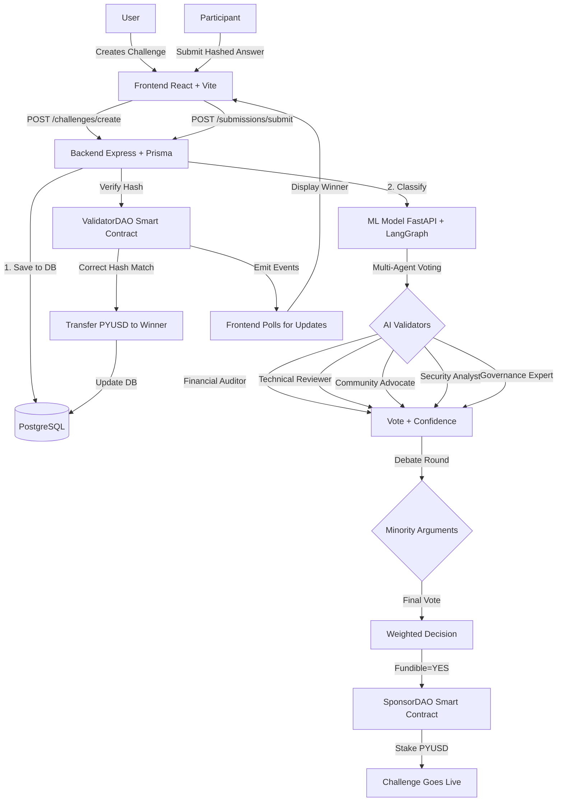

# Gauntlet: AI-Powered Decentralized Challenge Platform

> **Where Innovation Meets Incentivization Through Blockchain & AI**

---

## Table of Contents
- [Overview](#overview)
- [Problem Statement](#problem-statement)
- [Core Features](#core-features)
- [Architecture](#architecture)
- [Tech Stack](#tech-stack)
- [Why This Stack](#why-this-stack)
- [Quick Start](#quick-start)
- [Environment Setup](#environment-setup)
- [How to Run the Frontend](#how-to-run-the-frontend)

---

## Overview

**Gauntlet** is an AI-powered decentralized challenge platform that redefines how innovation challenges, hackathons, and grants are conducted.  
It introduces **trustless verification**, **AI-based governance**, and **instant blockchain payouts**, creating a transparent and efficient innovation ecosystem.

---

## Problem Statement

### 1. Inefficient Capital Allocation
Traditional grant and hackathon systems rely on manual evaluation, subjective judging, and delayed payouts. Innovators often face weeks or months of uncertainty.

### 2. Lack of Trust & Verification
Current platforms depend on manual review of challenge submissions. There is no cryptographic proof that solutions are correct without revealing them prematurely.

### 3. AI Integration Gap in Governance
Although AI can evaluate proposals objectively, most DAOs still depend on human voting, creating inefficiency and bias in decision-making.

---

## Core Features

### 1. Multi-Agent AI Governance
Gauntlet uses a **LangGraph-powered multi-agent workflow** consisting of five specialized AI validators:

- **Financial Auditor**
- **Technical Reviewer**
- **Community Advocate**
- **Security Analyst**
- **Governance Expert**

**Debate Mechanism:**  
Validators vote independently, and minority opinions trigger an automated debate round. Validators can revise their stance, producing a **deliberative AI consensus**.

---

### 2. Cryptographic Answer Verification

- Participants submit **SHA-256 hashed answers** instead of plaintext.
- Smart contracts validate hashes instantly.
- **PYUSD rewards** are automatically released upon verification.
- Supports both **winner-takes-all** and **first-correct** modes.

---

### 3. Dual-DAO Architecture

**SponsorDAO (Challenge Management & Escrow):**
- Creates challenges with staked PYUSD rewards
- Adds a 10% bonus from the DAO treasury
- Manages escrow and releases funds upon validation

**ValidatorDAO (Answer Validation):**
- Receives participant hashes
- Emits on-chain `AnswerSubmitted` and `ChallengeCompleted` events
- Triggers PYUSD transfer to the verified winner automatically

---

### 4. Immersive Frontend Experience

- Dark/Light mode with smooth transitions
- Real-time event polling for live updates
- Framer Motion-based micro-interactions
- Web3 wallet integration via **MetaMask** and **WalletConnect (Wagmi)**
- Responsive design for desktop and mobile

---

### 5. Live Analytics Dashboard

- Platform-wide statistics and PYUSD pool tracking
- Top domains visualized via animated progress bars
- PostgreSQL-backed real-time activity feed

---

## Architecture



---

## Tech Stack

### Smart Contracts (Polygon / Ethereum L2)
- **Solidity 0.8.20**
- **Foundry** for testing and deployment
- **OpenZeppelin** for role-based access control and security
- **PYUSD** integration for stable, fiat-pegged payouts
- **SafeERC20** to protect against transfer exploits
- Roles: `SPONSOR_ROLE`, `VALIDATOR_ROLE`

---

### Backend (Node.js)
- **Express 5.x** for high-performance REST APIs
- **Prisma ORM** for type-safe PostgreSQL integration
- **Ethers.js 6.x** for blockchain interaction
- **PostgreSQL** for relational data storage
- **Event Polling System** for real-time blockchain event tracking

---

### ML Model (Python)
- **FastAPI** for asynchronous, low-latency inference
- **LangChain + LangGraph** for multi-agent workflow orchestration
- **Google Gemini 2.0 Flash** for proposal and challenge evaluation
- **Pydantic** for structured, type-safe AI responses
- **Parallelized Validator Voting** for sub-5s latency

---

### Frontend (React + Vite)
- **React 18 + Vite** for ultra-fast builds and HMR
- **Tailwind CSS** for scalable UI with a custom design system
- **Framer Motion** for smooth, 60 FPS animations
- **Wagmi + Viem** for Web3 wallet connections (MetaMask, WalletConnect, etc.)
- **Axios** for robust API requests with retry logic
- **React Router** for lazy-loaded route handling

---

## Why This Stack

| Layer        | Stack Choice        | Key Reason                                                       |
| ------------ | ------------------ | ---------------------------------------------------------------- |
| **Contracts**| Solidity + Foundry | Secure, modular, tested environment for DAO logic                |
| **Backend**  | Express + Prisma   | Scalable, type-safe data layer                                   |
| **AI Layer** | FastAPI + LangGraph| Enables AI validator parallelism & structured reasoning          |
| **Frontend** | React + Vite       | Performance-first frontend with real-time updates                |
| **Database** | PostgreSQL         | Reliable relational persistence with Prisma schema sync          |
| **Web3**     | Wagmi + Ethers.js  | Simplified wallet interaction and contract calls                 |

---

## Quick Start

### Prerequisites

Ensure you have the following installed:
- Node.js **v18+**
- Python **v3.10+**
- PostgreSQL
- Foundry (for smart contract deployment)

---

### 1️⃣ Clone & Install

```bash
git clone https://github.com/Rudr-1705/Gauntlet.git
cd Gauntlet

# Install root dependencies (may include frontend)
npm install

# Install backend dependencies
cd backend && npm install

# Install ML model dependencies
cd ../ml-model && pip install -r requirements.txt
```

---

## Environment Setup

### 1️⃣ Create a Virtual Environment (for Python modules)
```bash
python -m venv venv
```

### 2️⃣ Activate Environment
- **Windows:**
  ```bash
  venv\Scripts\activate
  ```
- **Linux/Mac:**
  ```bash
  source venv/bin/activate
  ```

### 3️⃣ Install Python Dependencies
```bash
pip install -r requirements.txt
```

### 4️⃣ Setup Environment Variables

Create a `.env` file in the project root and add the following (and more as needed):

```text
GOOGLE_API_KEY=your_google_api_key
# Add more keys as required for your LLM provider
```

---

## 🚀 Run the Application

### 🧠 Start FastAPI Backend (ML/AI Layer)
```bash
cd ml-model
uvicorn backend.main:app --reload
```
Your Agent server will be running at http://127.0.0.1:8080

---

## 💻 How to Run the Frontend

1. **Navigate to the frontend directory**  
   If your frontend is in the root or a `frontend` sub-folder, navigate there:
   ```bash
   cd <frontend-directory>  # Replace with actual path if not root
   ```

2. **Install dependencies**
   ```bash
   npm install
   ```

3. **Configure environment variables**  
   Create a `.env` file in the frontend directory if required (see `.env.example` if provided).

4. **Start the frontend development server**
   ```bash
   npm run dev
   ```
   This will start the Vite-powered React app, usually at [http://localhost:5173](http://localhost:5173) (or as indicated in your console).

5. **Connect your Web3 wallet**  
   Use MetaMask or WalletConnect to interact with blockchain features.

---

## 🛠 Additional Notes

- For production builds, use `npm run build` in the frontend directory.
- Ensure all backend, ML, and smart contract services are running if the frontend depends on live APIs or blockchain events.
- For blockchain interaction, ensure your wallet is connected to the correct network (e.g., Polygon, Ethereum L2).

---

## 📄 License

Distributed under the MIT License. See `LICENSE` for more information.
